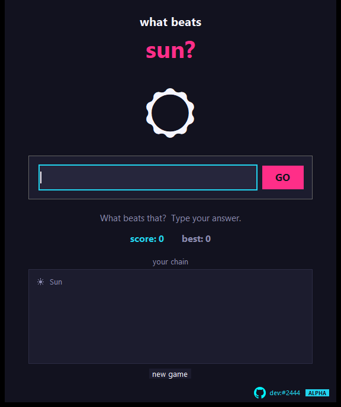

# What Beats Stone?

**An offline clone of the "what beats rock" game - a local AI model is the referee.**

---

> **ALPHA** - this is an early version. It works for the author, but expect rough edges and changes. Bug reports are welcome.

Start with *Stone*. Type something that beats it. A local [Ollama](https://ollama.com) model decides whether it counts - if it does, your word becomes the new thing and your score goes up. Words you already used are banned; a weak or nonsense answer ends the game. No internet, no account.

This is an unofficial fan project and has nothing to do with the original website.

## What it does

- The referee rates every answer from 0 to 10; from 6 upwards it counts
- Chain length and your best score are tracked
- Runs completely offline against your own Ollama model
- One small file, no installer

## Download

Download **`WhatBeatsStone.exe`** from the [releases page](../../releases) or straight from this repository. You need [Ollama](https://ollama.com) running locally with the model `qwen2.5vl:7b` (see the setup help).

New to this? Follow **[SETUP-HELP.md](SETUP-HELP.md)** - it walks you through installing and starting it.

## Good to know

- A 7B model is sometimes generous ("scissors beat rock"), just like the real game - the fun is keeping the chain alive without repeating a word. A bigger model judges stricter.

---

Made by **dev:#2444** - [github.com/hash2444](https://github.com/hash2444) - [what-beats-stone](https://github.com/hash2444/what-beats-stone)
